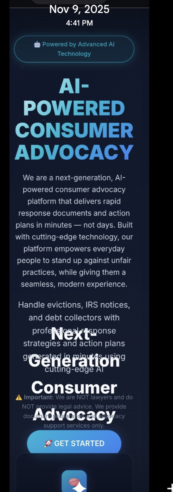

# BRAND STYLE GUIDE
## Official Design Truth for Turbo Response

**Last Updated:** February 9, 2026  
**Authority:** Chief Strategist  
**Purpose:** This overrides git guesses and defines the single source of truth for brand design.

---

## 🎨 OFFICIAL HOMEPAGE BACKGROUND STANDARD

### Reference Screenshot (Nov 9, 2025)
**File:** `HOMEPAGE_BRAND_REFERENCE_2025-11-09.png`



**This screenshot is the ONLY approved reference for homepage background colors.**

### Visual Description
- **Top:** Dark navy/black
- **Center:** Teal/cyan glow effect
- **Bottom:** Warm tone with soft glow overlay

---

## 🎯 APPROVED GRADIENT SPECIFICATION

### CSS Implementation
```css
:root {
  --primary-gradient: linear-gradient(135deg, #0f172a 0%, #1e293b 50%, #334155 100%);
}

body {
  background: var(--primary-gradient);
}
```

### Color Breakdown
| Position | Hex Code | RGB | Description |
|----------|----------|-----|-------------|
| 0% (Top) | `#0f172a` | rgb(15, 23, 42) | Dark navy blue |
| 50% (Middle) | `#1e293b` | rgb(30, 41, 59) | Medium navy |
| 100% (Bottom) | `#334155` | rgb(51, 65, 85) | Light slate |

---

## 🎨 APPROVED COLOR PALETTE

### Primary Colors
```css
--accent-cyan: #06b6d4;            /* Bright cyan - CTA buttons, headings */
--accent-blue: #3b82f6;            /* Blue - secondary accents */
--accent-purple: #8b5cf6;          /* Purple - tertiary accents */
--accent-yellow: #eab308;          /* Yellow - highlights, warnings */
```

### Text Colors
```css
--text-primary: #f8fafc;           /* Pure white - headings */
--text-secondary: #cbd5e1;         /* Light gray - body text */
--text-muted: #64748b;             /* Muted gray - secondary info */
```

### Effects
```css
--glow-cyan: 0 0 20px rgba(6, 182, 212, 0.3);
--glow-blue: 0 0 20px rgba(59, 130, 246, 0.3);
```

---

## 📐 TYPOGRAPHY

### Font Family
```css
font-family: -apple-system, BlinkMacSystemFont, 'Segoe UI', Roboto, Oxygen, Ubuntu, Cantarell, sans-serif;
```

### Font Sizes
- **Hero Title:** `clamp(3rem, 8vw, 6rem)`
- **Section Titles:** `2.5rem`
- **Body Text:** `1.1rem`
- **Small Text:** `0.95rem`

---

## 🚫 DO NOT CHANGE WITHOUT APPROVAL

**These specifications are locked and cannot be modified without Chief's explicit approval:**

1. Homepage background gradient (`#0f172a → #1e293b → #334155`)
2. Primary accent color (`#06b6d4` cyan)
3. Text hierarchy and colors
4. Font family

---

## ⚠️ COMMON MISTAKES TO AVOID

### ❌ WRONG: Using COLOR_SYSTEM.md colors
```css
/* DO NOT USE THESE - They are outdated */
--background-primary: #0a1628;
--background-secondary: #0f1e35;
--background-tertiary: #1a2942;
```

### ✅ CORRECT: Using approved gradient
```css
/* USE THESE - From Nov 9 reference */
--primary-gradient: linear-gradient(135deg, #0f172a 0%, #1e293b 50%, #334155 100%);
```

### ❌ WRONG: Setting global body styles in page-specific CSS
```css
/* EvictionDemo.css or GrantDemo.css */
body {
  background: var(--eviction-dark-red); /* This overrides homepage! */
}
```

### ✅ CORRECT: Using scoped page containers
```css
/* EvictionDemo.css */
.eviction-page {
  background: var(--eviction-dark-red); /* Only affects this page */
}
```

---

## 📊 VERIFICATION CHECKLIST

Before claiming any visual change is "done":

- [ ] Screenshot matches Nov 9 reference
- [ ] DevTools shows correct gradient: `linear-gradient(135deg, rgb(15, 23, 42) 0%, rgb(30, 41, 59) 50%, rgb(51, 65, 85) 100%)`
- [ ] No global body styles in page-specific CSS files
- [ ] Hard refresh in incognito mode confirms colors
- [ ] Chief approval received

---

**Last Verified:** February 9, 2026  
**Production Status:** ✅ Correct (Commit 4dfe492)  
**Next Review:** When any homepage visual change is proposed
